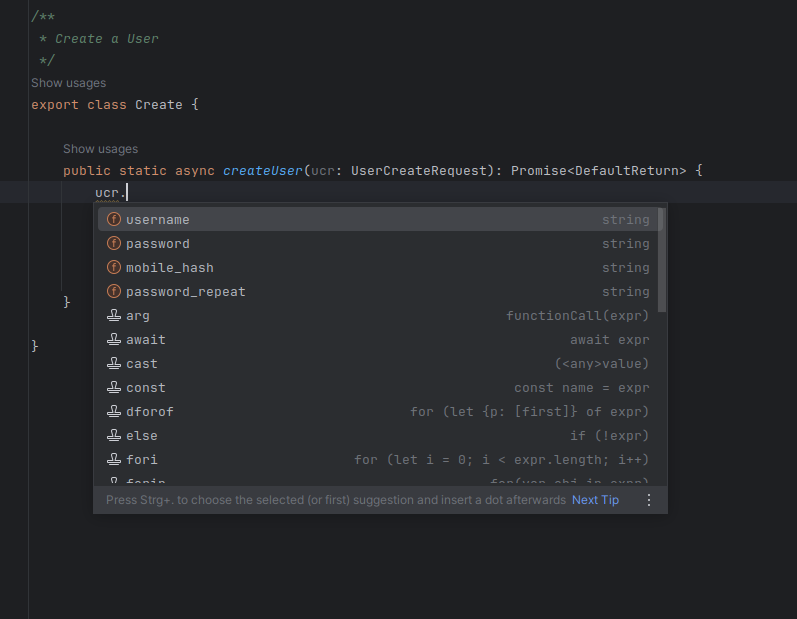

[](https://deepwiki.com/stefanwerfling/figtree)

# Figtree - Server Core
Is a package for the Config/DB/Logging and many other useful classes and utils for the quick implementation of a backend server or raw server.

## Implementation

- [x] Schemas declaration && validation (VTS)
- [x] Load environment variables (example for use over docker compose)
- [x] Config loading (json file)
- [x] Logging (Winston)
- [x] DB loading and handling (MariaDB, InfluxDB, Redis)
  - [ ] History (For data change)
- [x] Process handling
- [x] Server TCP Raw
- [x] HTTP/s Server and handling (Express.js, rateLimit, helmet, cookieParser, session parser, self temporary cert generation)
  - [x] Swagger UI Route and auto generation description from the schemas
  - [x] Unix HTTP Server (for intern communication)
  - [x] File Upload helper
  - [ ] AsyncLocalStorage for Context
- [x] Service handler (for initialized services or schedule)
- [x] Backend Main
- [ ] Provider hanlder
- [ ] Plugin Manager/Loader
- [ ] Crypto Managment
  - [x] Pem Helper/Parser
  - [x] Certificate generator (node-forge)

## Installation

You can install Figtree via npm:

```bash
npm install git+https://github.com/stefanwerfling/figtree.git
```

### TypeScript Users
If you're using TypeScript, it is highly recommended to install the necessary types. 

```bash
npm install --save-dev \
  @types/express \
  @types/express-session \
  @types/async-exit-hook \
  @types/cookie-parser \
  @types/uuid \
  @types/node \
  git+https://github.com/stefanwerfling/node-forge-types.git
```

## Used
### Routes and Swagger
Using schemas as route registered on the HTTP server can be automatically generated (for OpenAPI) for the Swagger UI API. The process consists of defining the schema, registering the route, and its types. Generics ensure that all types are correct in the route handle. Data that does not match the schema is automatically returned with an error. This reduces the development process and allows the focus to be on functionality.

<table>
    <tr>
        <td>
            
        </td>
        <td>
⟶
        </td>
        <td>
            
        </td>
        <td>
⟶
        </td>
        <td>
            
        </td>
        <td>
⟶
        </td>
        <td>
            
        </td>
    </tr>
</table>